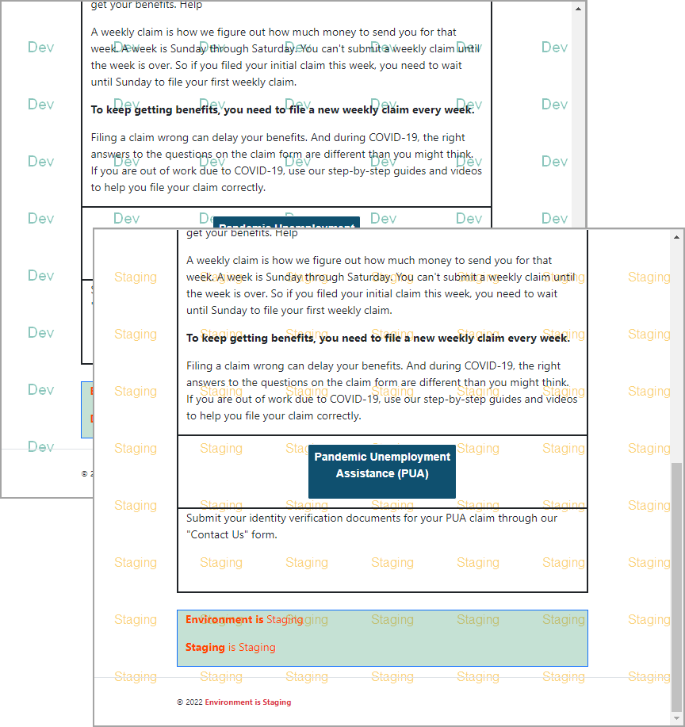
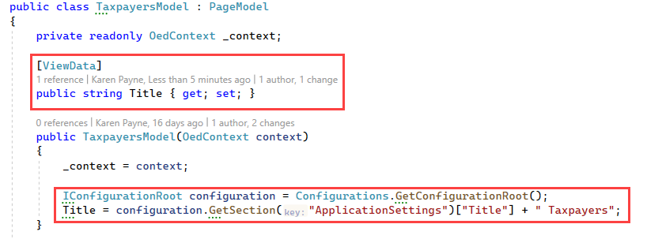

# Distinguish ASPNETCORE_ENVIRONMENT by background image for Razor Pages


Background images can be used to indicate which environment a web application is running in and/or showing the current environment in HTML element such as in the footer of each page of the application.

Using either background images clearly indicates the current environment without disrupting application operations and clearly shows how well a design appears in different environments.

Suppose an application design was never properly tested in say staging and when a tester does finds issues which for instance may stem from bleed through from a calling application using a global style sheet that only happens in staging and even production. A developer or a team of developers who do not communicate and test global styles can cause these issues.

# Requirements

Code provides was written using Microsoft Visual Studio 2022, .NET Core 6. If using Visual Studio 2019,.NET Core 5, simply follow the instructions below w/o running the provided project

## Setting up background images for environments

First decide on images that will work for your application, if there is no background image than consider using the images provided under `wwwroot\images` while if there is a current background image this is up to the reader to figure out what works best for them.

The following shows how to setup background images for staging and development.

Open _Layout.cshtml, inside of `<header>` add the following.

```html
@* indicate we are in dev environment *@
<environment names="Development">

    <style>
        body {
            background-image: url(/lib/images/dev_background.png);
            background-repeat: repeat;
        }
    </style>

</environment>
        
@* indicate we are in staging environment *@
<environment names="Staging">

    <style>
        body {
            background-image: url(/lib/images/stage_background.png);
            background-repeat: repeat;
        }
    </style>

</environment>
```

There is a great deal we can do with [environment](https://learn.microsoft.com/en-us/aspnet/core/fundamentals/environments?view=aspnetcore-6.0) other than simply setting up background images, for instance, use different style sheets for different environments or use a minified version of a style sheet in production while the full version in other environments to easy debugging.

## Setting up the footer

For a standardard footer insert `environment include` for staging and development

```html
<footer class="border-top footer">
    <div id="footMain" class="container" style="font-size: x-small;">
        &copy; @DateTime.Now.Year
        <environment include="Staging,Development">
            <span class="fw-bold text-danger">Environment is @Environment.GetEnvironmentVariable("ASPNETCORE_ENVIRONMENT")</span>
        </environment>
    </div>
</footer>
```

## Results



# Less in your face

In the case a background image does not work for your design then use the footer above or perhaps adding `@Environment.GetEnvironmentVariable("ASPNETCORE_ENVIRONMENT")` someplace in the interface so you can know the environment.

## Appsettings.json

There is a default file `appsettings.json` stagging `appsettings.Staging.json` and `appsettings.Development.json`.

In `Taxpayers` page, read title from appsettings according to the environment set



In the appsettings file.

```json
"ApplicationSettings": {
"Title": "Stage"
},
```

## EF Core
> **Note**
> Is setup with AutoInclude in TaxpayerConfiguration.cs

# Summary

Code presented can assist in knowing which enviroment you are running a Razor Pages app in and can help figuring out issues between different environments that does not carry over to production. And as a bonus an introduction to [environment](https://learn.microsoft.com/en-us/aspnet/core/fundamentals/environments?view=aspnetcore-6.0).

## See also

- Razor Pages [The Environment Tag Helper](https://www.learnrazorpages.com/razor-pages/tag-helpers/environment-tag-helper)
- Razor Pages [CSS Isolation](https://github.com/karenpayneoregon/razor-pages-style-isolation)
- [Bootstrap tooltips](bootstrapToolTips.md)